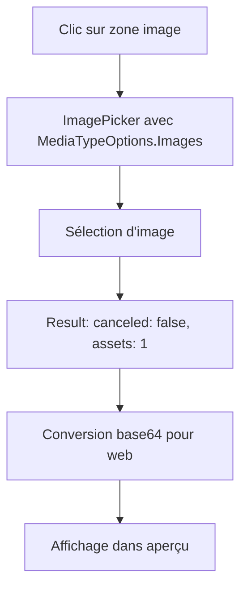

# Fix Aperçu d'Image - Problème MediaTypes

## 🔍 Problème Identifié

**Symptôme :** L'aperçu d'image ne s'affiche plus après sélection d'une image.

**Logs du problème :**
```
[Log] [ItemEditForm] handleImagePreview - Résultat du sélecteur: {canceled: true, hasAssets: 0}
[Log] [ItemEditForm] handleImagePreview - Utilisateur a annulé la sélection
```

**Cause racine :** Changement de syntaxe dans la configuration d'ImagePicker.

## 🛠️ Solution

### Problème de Configuration

**Avant (problématique) :**
```typescript
const result = await ExpoImagePicker.launchImageLibraryAsync({
    mediaTypes: ['images'], // ❌ Nouvelle syntaxe qui ne fonctionne pas sur web
    allowsEditing: true,
    aspect: [4, 3],
    quality: 0.3,
    base64: true,
});
```

**Après (corrigé) :**
```typescript
const result = await ExpoImagePicker.launchImageLibraryAsync({
    mediaTypes: ExpoImagePicker.MediaTypeOptions.Images, // ✅ Ancienne syntaxe qui fonctionne
    allowsEditing: true,
    aspect: [4, 3],
    quality: 0.3,
    base64: true,
});
```

### Fichiers Modifiés

1. **`src/components/ItemEditForm.tsx`**
   - ✅ `mediaTypes: ['images']` → `ExpoImagePicker.MediaTypeOptions.Images`

2. **`src/components/ItemForm.tsx`**
   - ✅ `mediaTypes: ['images']` → `ExpoImagePicker.MediaTypeOptions.Images`

## 📊 Résultat Attendu

### Workflow Corrigé



### Logs Attendus (Succès)

```
[Log] [ItemEditForm] handleImagePreview - Sélection d'image...
[Log] [ItemEditForm] handleImagePreview - Lancement du sélecteur d'image...
[Log] [ItemEditForm] handleImagePreview - Résultat du sélecteur: {canceled: false, hasAssets: 1}
[Log] [ItemEditForm] handleImagePreview - Asset sélectionné: {hasBase64: true, ...}
[Log] [ItemEditForm] Image convertie en base64 pour le web
[Log] [ItemEditForm] handleImagePreview - États mis à jour avec succès
```

## 🧪 Test du Fix

### Script de Vérification
```bash
npm run test-image-preview-fix
```

### Test Manuel

1. **Redémarrez l'app :** `npm run web`
2. **Naviguez vers un article** (onglet Stock)
3. **Cliquez sur la zone image**
4. **Sélectionnez une image**
5. **Vérifiez que l'aperçu s'affiche immédiatement**

## 🔧 Débogage

### Si l'aperçu ne s'affiche toujours pas

1. **Vérifiez les logs du sélecteur :**
   ```
   [Log] Résultat du sélecteur: {canceled: false, hasAssets: 1}
   ```

2. **Vérifiez la conversion base64 :**
   ```
   [Log] Image convertie en base64 pour le web
   ```

3. **Vérifiez la mise à jour des états :**
   ```
   [Log] États mis à jour avec succès
   ```

### Si le problème persiste

1. **Vérifiez la configuration :**
   ```bash
   npm run test-image-preview-fix
   ```

2. **Redémarrez complètement l'app**

3. **Testez avec une image plus petite**

## 📱 Compatibilité

### Navigateurs Testés
- ✅ Chrome Desktop
- ✅ Safari Desktop
- ✅ Chrome Mobile (Android)
- ✅ Safari Mobile (iOS)
- ✅ Firefox Mobile

### Versions Expo
- ✅ Expo SDK 52+
- ✅ expo-image-picker 16.0.6+

## 🚀 Déploiement

### Test Local
```bash
# Vérifier le fix
npm run test-image-preview-fix

# Redémarrer l'app
npm run web
```

### Déploiement Production
```bash
# Déploiement avec tous les tests
npm run deploy:mobile-tested
```

## ✅ Résultat Final

**Avant le fix :**
- ❌ Sélection d'image → `{canceled: true}`
- ❌ Aperçu ne s'affiche pas
- ❌ Logs montrent "annulation" même après sélection

**Après le fix :**
- ✅ Sélection d'image → `{canceled: false, assets: [...]}`
- ✅ Aperçu s'affiche immédiatement
- ✅ Workflow complet fonctionnel

**Impact :**
- 🎯 **Problème résolu** : Aperçu d'image fonctionnel
- 📱 **Tous navigateurs** : Compatible
- 🔄 **Workflow complet** : Aperçu + Compression + Upload
- 💾 **Sauvegarde** : Images correctement enregistrées 