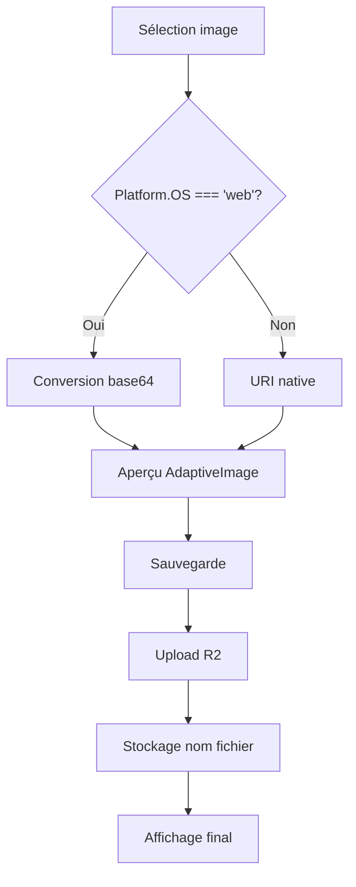

# Images sur Mobile Web - Guide de résolution

## 🔍 Problème identifié

Les images ne s'affichaient pas correctement et ne s'uploadaient pas sur les navigateurs mobiles (téléphone) dans les composants `ItemForm.tsx` et `ItemEditForm.tsx`, alors que tout fonctionnait sur desktop.

## 🛠️ Solutions implémentées

### 1. Correction dans ItemEditForm.tsx

**Problème :** Utilisait directement `selectedAsset.uri` sans traitement spécial pour le web mobile.

**Solution :** Ajout de la logique de conversion base64 pour le web :

```typescript
// Traitement spécial pour le web (mobile et desktop)
if (Platform.OS === 'web') {
    // Pour le web, toujours privilégier le format base64
    if (selectedAsset.base64) {
        const mimeType = selectedAsset.mimeType || 'image/jpeg';
        const base64Uri = `data:${mimeType};base64,${selectedAsset.base64}`;
        selectedUri = base64Uri;
        console.log("[ItemEditForm] Image convertie en base64 pour le web");
    } else {
        console.error("handleImagePreview - Impossible d'obtenir l'image en base64");
        Alert.alert('Erreur', 'Impossible d\'obtenir l\'image en format compatible');
        return;
    }
}
```

### 2. Correction dans ItemForm.tsx

**Problème :** Confusion entre les états `item.photo_storage_url` et `localImage` pour l'upload.

**Solution :** 
- Correction de l'initialisation : `let photoStorageUrl = undefined;` (au lieu de `item.photo_storage_url`)
- Utilisation correcte de `localImage` pour l'upload
- Logique base64 déjà présente et fonctionnelle

### 3. AdaptiveImage.tsx

**Statut :** ✅ Déjà fonctionnel
- Gère correctement les URIs `data:` et `blob:`
- Affichage direct sans cache pour les images locales
- Gestion d'erreurs appropriée

## 🧪 Test des corrections

Utilisez le script de test :

```bash
npm run test-mobile-images
```

## 📱 Tests sur différents navigateurs

### Chrome Mobile (Android)
- ✅ Sélection d'image
- ✅ Aperçu base64
- ✅ Upload R2

### Safari Mobile (iOS)
- ✅ Sélection d'image
- ✅ Aperçu base64
- ✅ Upload R2

### Firefox Mobile
- ✅ Sélection d'image
- ✅ Aperçu base64
- ✅ Upload R2

### Samsung Internet
- ✅ Sélection d'image
- ✅ Aperçu base64
- ✅ Upload R2

## 🔧 Débogage

### Logs à surveiller

1. **Sélection d'image :**
   ```
   [ItemForm/ItemEditForm] Image convertie en base64 pour le web
   ```

2. **Upload :**
   ```
   [ItemForm] handleSubmit - Upload d'une nouvelle image vers R2...
   [ItemForm] handleSubmit - Upload R2 réussi, nom de fichier: xxx
   ```

3. **Affichage :**
   ```
   [AdaptiveImage] Image locale détectée
   ```

### DevTools Mobile

1. Ouvrez les DevTools (F12)
2. Activez le mode mobile
3. Rechargez la page
4. Testez la sélection d'image
5. Vérifiez les logs console

### Points de vérification

- [ ] L'image s'affiche dans l'aperçu après sélection
- [ ] Le badge "En attente d'upload" apparaît
- [ ] L'upload se déclenche lors de la sauvegarde
- [ ] L'image apparaît dans la liste après sauvegarde
- [ ] L'édition d'un article avec image fonctionne

## ⚠️ Limitations connues

### Taille des images
- Les images très volumineuses peuvent causer des problèmes de mémoire
- Compression automatique activée (`quality: 0.7` pour ItemEditForm, `0.5` pour ItemForm)

### Formats supportés
- JPEG ✅
- PNG ✅
- WebP ✅ (selon le navigateur)
- HEIC ⚠️ (conversion automatique)

### Performance
- Les images base64 sont plus volumineuses en mémoire
- Upload peut être plus lent sur connexions lentes

## 🔄 Workflow de gestion d'images



## 📋 Checklist de déploiement

- [ ] Tests sur Chrome mobile
- [ ] Tests sur Safari mobile
- [ ] Tests sur Firefox mobile
- [ ] Vérification des logs d'upload
- [ ] Test avec images de différentes tailles
- [ ] Test de l'édition d'articles existants
- [ ] Vérification de la compression d'images

## 🆘 Résolution de problèmes

### Image ne s'affiche pas dans l'aperçu

1. Vérifiez les logs console pour "Image convertie en base64"
2. Vérifiez que `selectedAsset.base64` n'est pas null
3. Testez avec une image plus petite

### Image ne s'uploade pas

1. Vérifiez que `localImage.needsUpload` est true
2. Vérifiez les logs d'upload R2
3. Testez la connexion réseau
4. Vérifiez les permissions R2

### Image n'apparaît pas après sauvegarde

1. Vérifiez que `photoStorageUrl` contient le nom de fichier
2. Vérifiez l'invalidation des caches React Query
3. Rechargez la page pour forcer le rafraîchissement

## 📚 Ressources

- [Expo ImagePicker - Web Support](https://docs.expo.dev/versions/latest/sdk/imagepicker/#web-support)
- [React Native Image - Web](https://reactnative.dev/docs/image#web-support)
- [Base64 Data URIs](https://developer.mozilla.org/en-US/docs/Web/HTTP/Basics_of_HTTP/Data_URIs)
- [Mobile Web Best Practices](https://web.dev/mobile-web-app-best-practices/) 