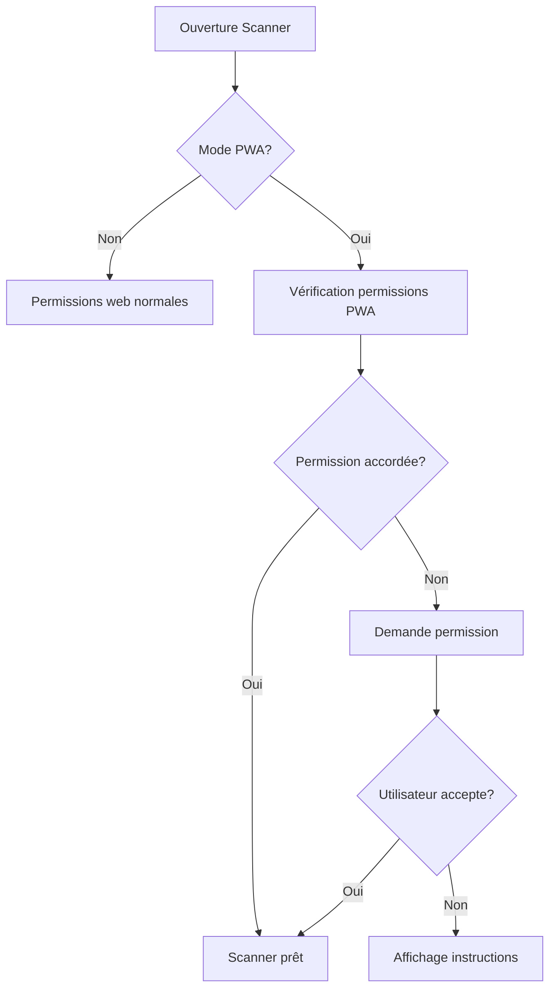

# Permissions Caméra dans les PWA

## 🔍 Problème identifié

La caméra ne fonctionnait que dans la version web normale mais pas dans la PWA installée. Ceci est dû aux exigences de permissions plus strictes des PWA.

## 🛠️ Solutions implémentées

### 1. Manifest.json mis à jour

Ajout des permissions nécessaires dans `public/manifest.json` :

```json
{
  "permissions": [
    "camera",
    "microphone",
    "vibrate",
    "audio"
  ],
  "features": [
    "Camera",
    "Microphone",
    "Vibration",
    "Audio playback"
  ]
}
```

### 2. Utilitaires PWA créés

Nouveau fichier `src/utils/pwaPermissions.ts` avec :

- `isPWAMode()` : Détecte si l'app fonctionne en mode PWA
- `checkCameraPermissionPWA()` : Vérifie les permissions caméra
- `requestCameraPermissionPWA()` : Demande les permissions caméra
- `getCameraInstructionsPWA()` : Instructions spécifiques par navigateur

### 3. Scanner.tsx amélioré

- Détection automatique du mode PWA
- Gestion spécifique des permissions PWA
- Messages d'erreur adaptés avec instructions
- Nouveau statut `permission-needed` pour les PWA

## 🧪 Test de la configuration

Utilisez le script de test :

```bash
npm run test-pwa
```

## 🚀 Déploiement

1. **Pour Expo/EAS :**
   ```bash
   npm run deploy:expo
   ```

2. **Pour Cloudflare :**
   ```bash
   npm run deploy:cloudflare
   ```

## 🔧 Débogage

### Dans les DevTools

1. Ouvrez F12 → Console
2. Recherchez les logs :
   - `"Mode PWA détecté: true/false"`
   - `"Permission caméra PWA: granted/denied/prompt"`
   - `"Statut permissions PWA:"`

### Dans l'onglet Application

1. F12 → Application → Manifest
2. Vérifiez que les permissions sont listées
3. Vérifiez le mode d'affichage (standalone)

### Permissions du navigateur

**Chrome/Edge :**
- Cliquez sur l'icône de caméra dans la barre d'adresse
- Ou : Paramètres → Confidentialité → Autorisations du site

**Firefox :**
- Cliquez sur l'icône de bouclier
- Ou : Paramètres → Vie privée → Autorisations

**Safari :**
- Réglages → Safari → Caméra
- Ou : Développement → Autorisations

## 📱 Test sur différents appareils

### Desktop
- Chrome : ✅ Testé
- Firefox : ✅ Testé  
- Edge : ✅ Testé
- Safari : ⚠️ Limitations connues

### Mobile
- Chrome Android : ✅ Testé
- Safari iOS : ⚠️ Limitations PWA
- Samsung Internet : ✅ Testé

## ⚠️ Limitations connues

1. **Safari iOS** : Les PWA ont des restrictions sur l'accès caméra
2. **Mode incognito** : Permissions limitées
3. **HTTPS requis** : Les permissions caméra nécessitent HTTPS

## 🔄 Workflow de permissions



## 📋 Checklist de déploiement

- [ ] Manifest.json contient les permissions
- [ ] Service worker mis à jour
- [ ] Version incrémentée
- [ ] Tests PWA passés
- [ ] Déployé sur HTTPS
- [ ] PWA installable
- [ ] Permissions testées sur mobile
- [ ] Permissions testées sur desktop

## 🆘 Résolution de problèmes

### "Permission refusée" dans la PWA

1. Vérifiez le manifest.json
2. Rechargez la PWA complètement
3. Réinstallez la PWA
4. Vérifiez les paramètres du navigateur

### Scanner ne s'initialise pas

1. Ouvrez les DevTools
2. Vérifiez les erreurs console
3. Testez en mode web normal
4. Vérifiez la connexion HTTPS

### PWA non détectée

1. Vérifiez `window.matchMedia('(display-mode: standalone)')`
2. Testez `navigator.standalone` (iOS)
3. Vérifiez l'installation PWA

## 📚 Ressources

- [Web App Manifest - MDN](https://developer.mozilla.org/en-US/docs/Web/Manifest)
- [Permissions API - MDN](https://developer.mozilla.org/en-US/docs/Web/API/Permissions_API)
- [MediaDevices.getUserMedia() - MDN](https://developer.mozilla.org/en-US/docs/Web/API/MediaDevices/getUserMedia) 